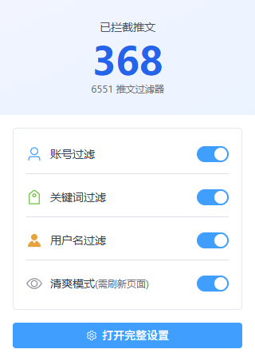
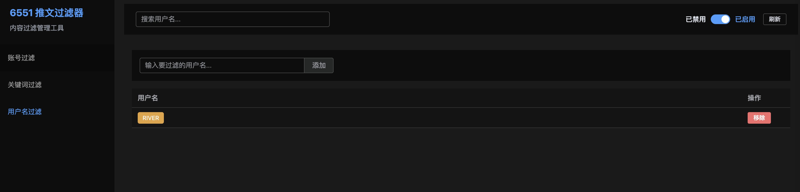

# NewsLiquid X 网页插件

一个用于自动过滤 Twitter/X 推文的 Chrome 浏览器插件，支持账号、关键词和用户名三种过滤方式。

## 功能特性

- **智能过滤**：支持账号、关键词、用户名三种过滤方式
- **实时过滤**：自动隐藏符合过滤规则的推文和回复
- **数据源**：从远程加载过滤数据（WASM + JSON）
- **手动管理**：支持手动添加过滤规则和白名单
- **统计展示**：实时显示已过滤推文数量和详细列表

### 过滤优先级

#### 账号过滤优先级（从高到低）

1. **手动账号白名单**：`manualWhitelistAccounts` - 最高优先级，永不过滤
2. **手动账号屏蔽**：`manualBlockedAccounts` - 即使在系统白名单中也会被屏蔽
3. **WASM 账号白名单**：`yap.wasm.v2` 的 `hasWhiteAccount` - 系统级白名单
4. **WASM 账号黑名单**：`yap.wasm.v2` 的 `hasAccount` - 系统级黑名单

#### 关键词和用户名过滤

5. **关键词过滤**
   - 关键词白名单：`manualWhitelistKeywords`
   - 系统关键词库：`infofi.json`
   - 手动屏蔽关键词：`manualBlockedKeywords`

6. **用户名过滤**
   - 用户名白名单：`manualWhitelistUsernames`
   - 系统用户名库：`handle.json`
   - 手动屏蔽用户名：`manualBlockedUsernames`

> **重要说明**：
> - **所有白名单账号**（手动+WASM）不受关键词和用户名过滤影响
> - 手动屏蔽优先级高于 WASM 白名单，可以屏蔽系统白名单中的账号
> - 关键词白名单和用户名白名单中的内容不会被过滤

## 功能截图

### 插件弹窗
显示过滤统计和快速开关

### 过滤效果
被过滤的推文会显示占位提示

### 过滤列表
右侧显示已过滤的推文统计

### 管理界面
完整的过滤规则管理界面

